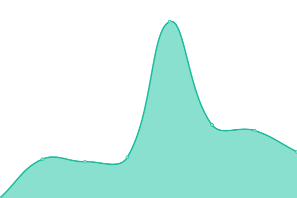

# [📈 Live Status](https://jckylalaina.github.io/uptime): <!--live status--> **🟧 Partial outage**

This repository contains the open-source uptime monitor and status page for [jckylalaina](https://jckylalaina.github.io/uptime), powered by [Upptime](https://github.com/upptime/upptime).

With [Upptime](https://upptime.js.org), you can get your own unlimited and free uptime monitor and status page, powered entirely by a GitHub repository. We use [Issues](https://github.com/jckylalaina/uptime/issues) as incident reports, [Actions](https://github.com/jckylalaina/uptime/actions) as uptime monitors, and [Pages](https://jckylalaina.github.io/uptime) for the status page.

<!--start: status pages-->
<!-- This summary is generated by Upptime (https://github.com/upptime/upptime) -->
<!-- Do not edit this manually, your changes will be overwritten -->
<!-- prettier-ignore -->
| URL | Status | History | Response Time | Uptime |
| --- | ------ | ------- | ------------- | ------ |
|  SKIILLZ | 🟩 Up | [skiillz.yml](https://github.com/jckylalaina/uptime/commits/HEAD/history/skiillz.yml) | 

 830ms
     
 | 

<a href="https://jckylalaina.github.io/uptime/history/skiillz">100.00%</a>
    

|  Eufonie | 🟩 Up | [eufonie.yml](https://github.com/jckylalaina/uptime/commits/HEAD/history/eufonie.yml) | 

 1575ms
     
 | 

<a href="https://jckylalaina.github.io/uptime/history/eufonie">100.00%</a>
    

|  Odoo Eufonie | 🟩 Up | [odoo-eufonie.yml](https://github.com/jckylalaina/uptime/commits/HEAD/history/odoo-eufonie.yml) | 

 1116ms
     
 | 

<a href="https://jckylalaina.github.io/uptime/history/odoo-eufonie">99.75%</a>
    

|  Moodle | 🟥 Down | [moodle.yml](https://github.com/jckylalaina/uptime/commits/HEAD/history/moodle.yml) | 

 0ms
     
 | 

<a href="https://jckylalaina.github.io/uptime/history/moodle">5.43%</a>
    

|  Click | 🟩 Up | [click.yml](https://github.com/jckylalaina/uptime/commits/HEAD/history/click.yml) | 

 644ms
     
 | 

<a href="https://jckylalaina.github.io/uptime/history/click">100.00%</a>
    

|  Guide Maurice | 🟥 Down | [guide-maurice.yml](https://github.com/jckylalaina/uptime/commits/HEAD/history/guide-maurice.yml) | 

 0ms
     
 | 

<a href="https://jckylalaina.github.io/uptime/history/guide-maurice">0.00%</a>
    

|  Maurice | 🟩 Up | [maurice.yml](https://github.com/jckylalaina/uptime/commits/HEAD/history/maurice.yml) | 

 1468ms
     
 | 

<a href="https://jckylalaina.github.io/uptime/history/maurice">47.68%</a>
    

<!--end: status pages-->

[**Visit our status website →**](https://jckylalaina.github.io/uptime)

## 📄 License

- Powered by: [Upptime](https://github.com/upptime/upptime)
- Code: [MIT](./LICENSE) © [jckylalaina](https://jckylalaina.github.io/uptime)
- Data in the `./history` directory: [Open Database License](https://opendatacommons.org/licenses/odbl/1-0/)
